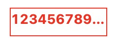

# styled-chain

use styled-components like this:

```tsx
const Div = styled.div.RedColor.Ellipsis({
  width: 100,
  height: 30,
  border: '1px solid'
});

<Div>
  12345678901234567890
</Div>
```

then you can get a component like below:



## install

```
npm install styled-chain
```

## usage

1. register styles
   
```js
  import sc from 'styled-chain';

  // register some styles
  sc.register('RedColor', { color: 'red' });
  sc.register('Ellipsis', {
    overflow: 'hidden',
    whiteSpace: 'nowrap',
    textOverflow: 'ellipsis',
    wordBreak: 'keep-all'
  });

  // then use
  const Div = styled.div.RedColor.Ellipsis({
    width: 100,
    height: 30,
    border: '1px solid'
  });
```

